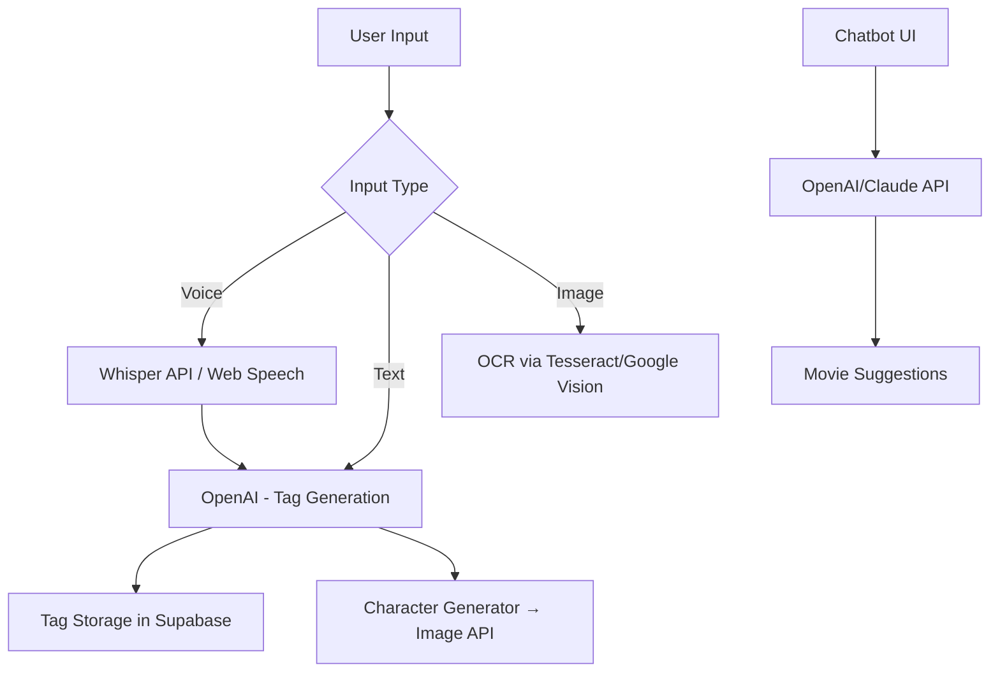

Architecture Guide

## 🧩 Tech Stack

| Layer                | Tool / Framework                                                       |
| -------------------- | ---------------------------------------------------------------------- |
| Frontend             | Next.js (React)                                                        |
| Backend-as-a-Service | Supabase (PostgreSQL + Auth + Storage + Edge Functions)                |
| AI Services          | OpenAI API / Replicate API / Hugging Face API (for NLP, CV, image gen) |
| Media Handling       | Cloudinary or Supabase Storage                                         |
| State Mgmt           | React Context + Zustand (lightweight global state)                     |
| Styling              | Tailwind CSS + Framer Motion                                           |
| Voice Input          | Web Speech API / Whisper API                                           |
| Image OCR            | Tesseract.js / Google Vision API                                       |

---

## 🗂️ Folder Structure

```
/ai-movie-app
├── public/
│   ├── images/                # Static assets (icons, backgrounds)
│   └── favicon.ico
├── src/
│   ├── app/                   # Next.js 14+ app directory
│   │   ├── page.tsx          # Home page
│   │   ├── record/           # Movie recording page (voice, image, text)
│   │   ├── search/           # Movie search and tag filtering
│   │   ├── recommend/        # Chatbot interface
│   │   └── character/        # Cartoon character generation
│   ├── components/           # Reusable UI components
│   │   ├── MovieCard.tsx
│   │   ├── VoiceRecorder.tsx
│   │   ├── UploadTicket.tsx
│   │   ├── ChatInput.tsx
│   │   └── TagList.tsx
│   ├── hooks/                # Custom React hooks
│   │   ├── useSupabase.ts
│   │   ├── useVoice.ts
│   │   ├── useChatbot.ts
│   │   └── useTags.ts
│   ├── lib/                  # Utility libraries
│   │   ├── supabaseClient.ts
│   │   ├── tagGenerator.ts   # Call OpenAI/Hugging Face to extract tags
│   │   ├── ocr.ts            # OCR logic from image
│   │   └── moodAnalyzer.ts   # Emotion analysis logic
│   ├── styles/               # Tailwind CSS overrides or global styles
│   │   └── globals.css
│   ├── state/                # Zustand or context stores
│   │   ├── useUserStore.ts
│   │   ├── useMovieStore.ts
│   │   └── useMoodStore.ts
│   └── types/                # TypeScript types
│       └── index.ts
├── .env.local                # Environment variables
├── next.config.js
└── README.md
```

---

## 📌 Module Responsibilities

### `/app/record/`

* Input: voice (speech-to-text), image (OCR), manual entry
* Calls:

  * `ocr.ts` → extract text from movie ticket
  * `tagGenerator.ts` → create semantic tags from user input
* Saves data to Supabase (movie, review, tags)

### `/app/search/`

* Fuzzy search via:

  * Tags (genre, mood, setting, characters)
  * Keywords from user query (processed by semantic search API)
* Filters using Supabase full-text + AI embeddings

### `/app/recommend/`

* Input: mood detected (via emoji picker / text / voice)
* Output: AI Chatbot recommends movies from user’s DB or global DB
* Uses `moodAnalyzer.ts` + `chatbot` API (GPT-4 or Claude)

### `/app/character/`

* Aggregates watched movies + preferences
* Calls image generation API (e.g., Replicate, SDXL) to create a cartoon character based on user’s "movie soul"

---

## 🧠 State Management

| Store           | What it stores                          | Scope    |
| --------------- | --------------------------------------- | -------- |
| `useUserStore`  | Auth session, profile data              | Global   |
| `useMovieStore` | Watched movies, tags, input in progress | Per Page |
| `useMoodStore`  | Current mood / daily state              | Global   |

Uses [Zustand](https://github.com/pmndrs/zustand) or React Context.

---

## 🧩 Supabase Integration

### 🗃️ Tables

| Table        | Purpose                                   |
| ------------ | ----------------------------------------- |
| `users`      | Auth & profiles                           |
| `movies`     | User-recorded movies (title, date, etc.)  |
| `tags`       | Tags extracted from review/emotion        |
| `reviews`    | User input (text, voice transcript, etc.) |
| `moods`      | Daily mood logs                           |
| `characters` | Cartoon avatar metadata + image link      |

### 📦 Supabase Services Used

* **Auth**: Magic link login, OAuth (Google)
* **Storage**: Ticket image uploads, generated character images
* **Edge Functions**: Optional for background AI processing (e.g., tag creation, emotion tracking)

---

## 🤖 AI Service Flow



---

## 🪄 Key Features Summary

| Feature                          | Powered by                             |
| -------------------------------- | -------------------------------------- |
| Voice input to review/log movie  | Whisper / Web Speech API               |
| OCR from movie tickets           | Tesseract.js / Google Vision API       |
| AI tag generation                | OpenAI GPT / HuggingFace Transformers  |
| Semantic fuzzy search            | Supabase + embeddings / Pinecone (opt) |
| Mood-aware movie recommendations | GPT / Claude + mood store              |
| Cartoon character creation       | Replicate (SDXL, StyleGAN)             |
| Clean & imaginative UI           | Tailwind CSS + Framer Motion + SVG art |

---

## 🔐 Environment Variables (.env.local)

```env
NEXT_PUBLIC_SUPABASE_URL=https://your-project.supabase.co
NEXT_PUBLIC_SUPABASE_ANON_KEY=your-anon-key
OPENAI_API_KEY=your-openai-key
OCR_API_KEY=your-ocr-key
CLOUDINARY_UPLOAD_URL=...
```

---

## ✅ Next Steps for Dev

1. Set up Supabase project and schema
2. Scaffold Next.js app with above structure
3. Implement voice & OCR modules
4. Integrate OpenAI tagging and chatbot APIs
5. Create fuzzy search and recommendation UI
6. Add cartoon character generator
7. Polish animations, transitions, UX
8. Launch and iterate 🚀
